# Intelligent-Furniture
> 联系方式 wangzichaochaochao@gmail.com

做好家居领域的智能对话系统，用科技方便生活！

## NLUKG（Natural Language Understanding and Knowledge Graph） 目标
具有“面向任务的理解与交互能力”，具体来说分为两个方面的能力：
1.	问答能力。解答用户的某个问题（如：今天天气怎么样、我的快递到哪儿了）；
2.	指令能力。执行用户指令（如：放一首流行音乐，让家庭机器人帮您打开空调、把咖啡端过来）；甚至通过一系列交互引导用户达成某项需求（如：通过注册-选座-下单完成订票）。

## 本资源内容
+ [智能家居项目调研](智能家居项目调研.md)
+ [智能家居需求分析V1.0](智能家居需求分析V1.0.md)
+ [智能家居项目资料整理](智能家居项目资料整理.md)
+ [智能家居_自然语言理解系统研发指南v0.1](智能家居_自然语言理解系统研发指南v0.1.docx)
+ [利用垂直网站抽取结构化数据构建知识图谱的方法](利用垂直网站抽取结构化数据构建知识图谱的方法.docx)
+ [智能家居项目_自然语言理解部分工作总结_190807](智能家居项目_自然语言理解部分工作总结_190807.pptx)

## 相关代码
+ [Customer-Chatbot](https://github.com/WenRichard/Customer-Chatbot)
+ [Entity-Relation-Extraction](https://github.com/yuanxiaosc/Entity-Relation-Extraction)
+ [BERT-for-Sequence-Labeling-and-Text-Classification](https://github.com/yuanxiaosc/BERT-for-Sequence-Labeling-and-Text-Classification)
+ [Hands-on-chat-robots](https://github.com/yuanxiaosc/Hands-on-chat-robots)

## 智能家居项目_自然语言理解部分工作总结_190807
> 完整信息，查看[智能家居项目_自然语言理解部分工作总结_190807](智能家居项目_自然语言理解部分工作总结_190807.pptx)

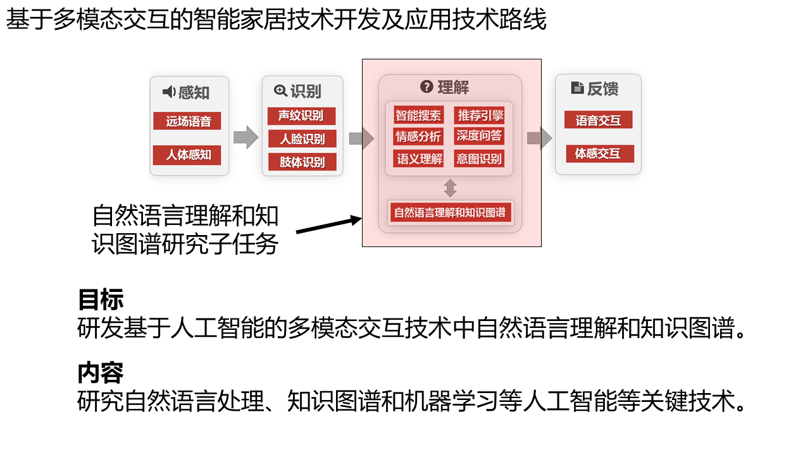
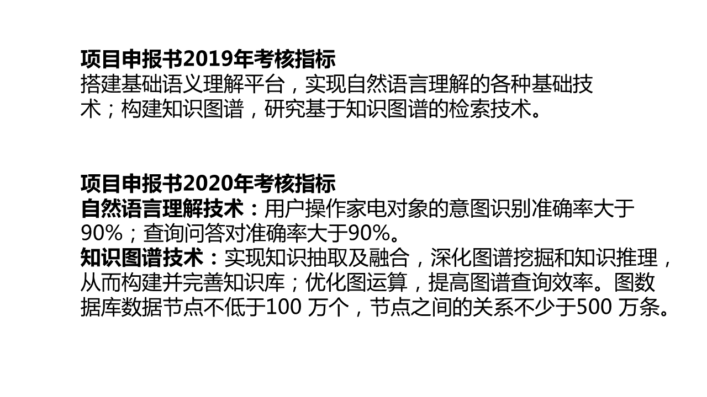
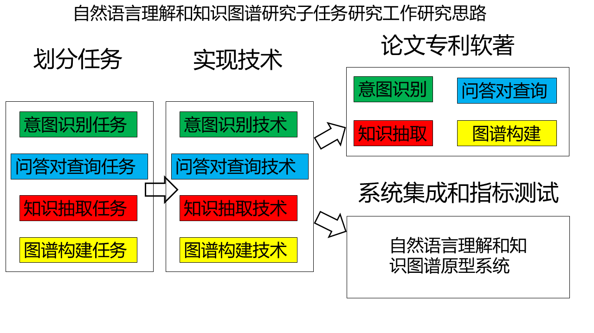
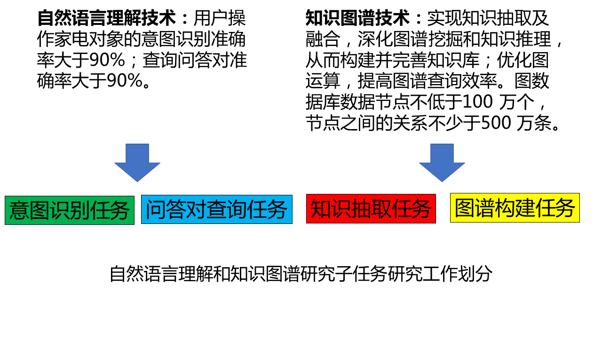
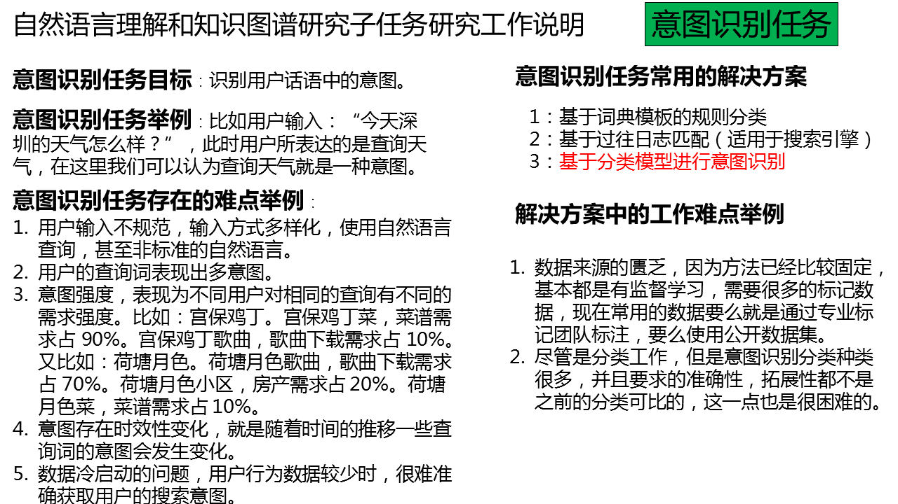
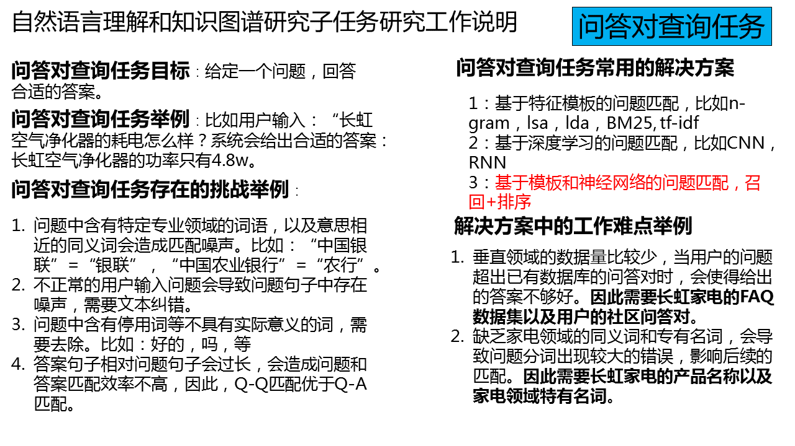
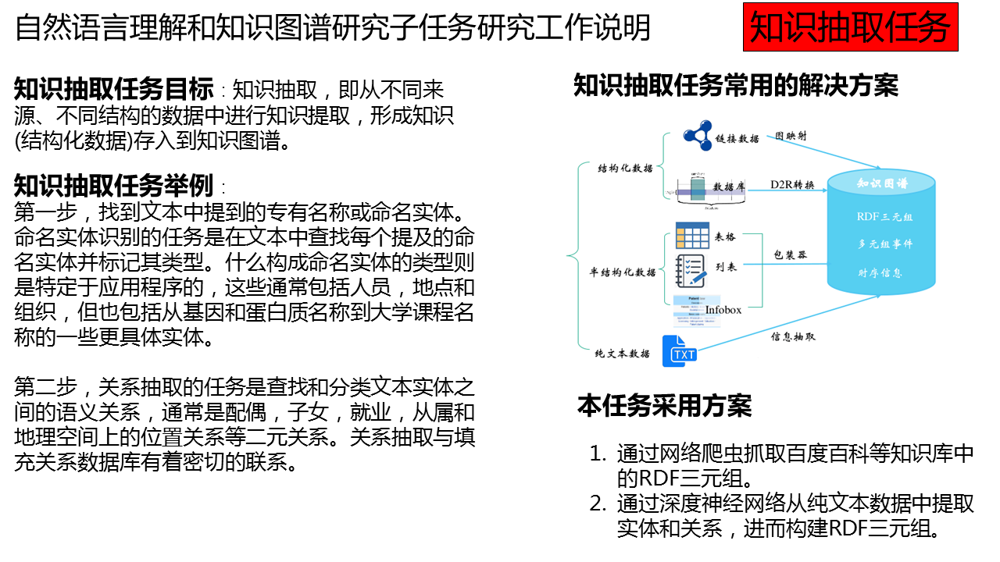
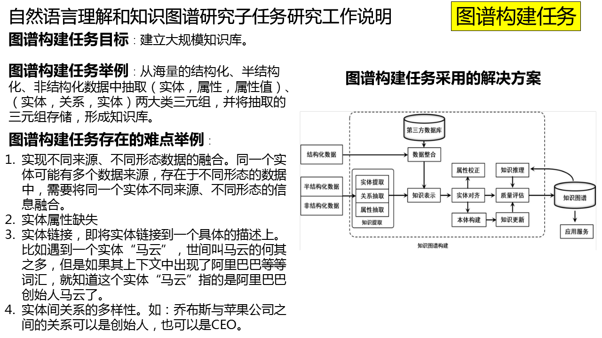
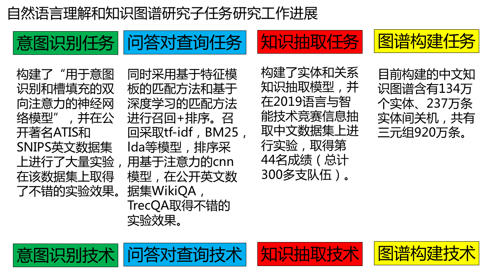

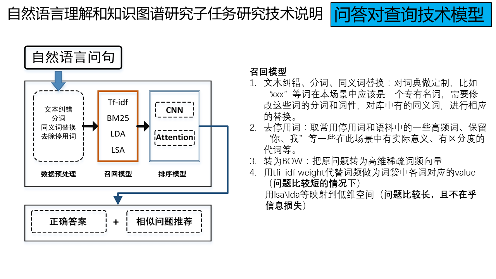
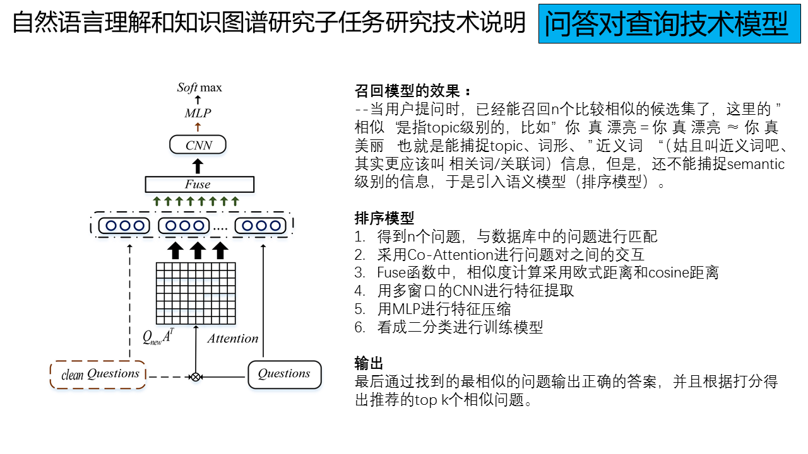
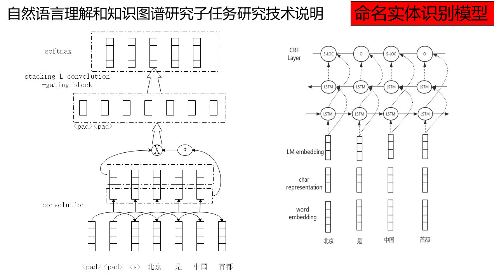

